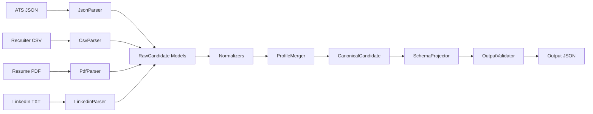

# Multi-Source Candidate Data Transformer

A production-quality Python pipeline that ingests candidate profiles from **four heterogeneous sources** — structured ATS JSON, structured Recruiter CSV, unstructured Resume PDF, and unstructured LinkedIn Profile text — normalizes the data, merges conflicts using deterministic confidence scores, tracks field-level provenance, validates the output schema, and projects custom configurations on the fly.

## Why This Exists

Recruiters and hiring teams collect candidate data from multiple systems: applicant tracking systems, recruiter spreadsheets, uploaded resumes, and LinkedIn profiles. Each source uses a different format, contains overlapping but inconsistent information, and varies in reliability.

This pipeline solves the **data unification problem**. It ingests all available candidate sources, normalizes them into a common schema, resolves conflicts deterministically (higher-confidence sources win), and produces a single, validated JSON profile with full provenance tracking — so you always know *where* each piece of data came from and *how confident* the system is in its accuracy.

---

## Key Features

| Feature | Description |
|---|---|
| **Multi-Source Ingestion** | Accepts ATS JSON, Recruiter CSV, Resume PDF, and LinkedIn TXT |
| **Structured + Unstructured Parsing** | Handles both machine-readable formats and free-text documents |
| **Deterministic Merge Strategy** | Priority-based conflict resolution: `ATS > CSV > Resume > LinkedIn` |
| **Provenance Tracking** | Every field records which source(s) it originated from |
| **Confidence Scoring** | Each field carries a confidence score (0.0–1.0) based on source reliability |
| **Configurable Projection** | Swap a JSON config to change the output schema without modifying code |
| **Schema Validation** | Pydantic-based validators ensure output integrity |
| **Extensible Architecture** | Add new parsers or sources without modifying existing pipeline stages |

---

## Architecture Diagram



---

## Pipeline Flow

```
Input Sources (ATS, CSV, Resume, LinkedIn)
         |
         v
    [ Parsers ]              Extract raw fields from each source
         |
         v
  [ RawCandidate ]           Uniform intermediate representation
         |
         v
  [ Normalizers ]            Standardize phones (E.164), dates, skills, country codes
         |
         v
  [ ProfileMerger ]          Resolve conflicts, calculate confidence, track provenance
         |
         v
[ CanonicalCandidate ]       Single unified candidate profile
         |
         v
 [ SchemaProjector ]         Remap fields according to projection config
         |
         v
 [ OutputValidator ]         Validate types via Pydantic, safe-null fallback
         |
         v
   [ Output JSON ]           Final merged, validated candidate profile
```

---

## Quick Start

### 1. Clone the Repository

```bash
git clone https://github.com/saisushanthmoturi/Eightfold_assessment.git
cd Eightfold_assessment
```

### 2. Install Dependencies

```bash
pip install pdfplumber pydantic phonenumbers pytest
```

> **Requires**: Python 3.10+

### 3. Run the Pipeline (All Four Sample Sources)

**Linux / macOS (Bash):**
```bash
python main.py \
  --ats input/ats.json \
  --csv input/recruiter.csv \
  --resume input/resume.pdf \
  --linkedin input/linkedin.txt \
  --output output/all_four.json
```

**Windows PowerShell:**
```powershell
python main.py `
  --ats input/ats.json `
  --csv input/recruiter.csv `
  --resume input/resume.pdf `
  --linkedin input/linkedin.txt `
  --output output/all_four.json
```

**Single-line (works everywhere):**
```bash
python main.py --ats input/ats.json --csv input/recruiter.csv --resume input/resume.pdf --linkedin input/linkedin.txt --output output/all_four.json
```

### 4. Run Tests

```bash
python -m pytest tests/
```

---

## Project Folder Structure

```text
Eightfold_assessment/
├── config/
│   ├── default.json              # Flat projection with confidence & provenance
│   └── custom.json               # Nested projection without metadata
├── input/
│   ├── ats.json                  # Sample ATS export (structured)
│   ├── recruiter.csv             # Sample recruiter spreadsheet (structured)
│   ├── resume.pdf                # Sample candidate resume (unstructured)
│   └── linkedin.txt              # Sample LinkedIn profile (unstructured)
├── merger/
│   └── profile_merger.py         # Deduplication, priority resolution, merging
├── models/
│   ├── raw.py                    # RawCandidate Pydantic schema
│   └── canonical.py              # CanonicalCandidate Pydantic schema
├── normalizers/
│   ├── country.py                # ISO-3166-1 alpha-2 country code mapping
│   ├── date.py                   # Date/time normalization (YYYY-MM)
│   ├── phone.py                  # Phone normalization (E.164)
│   ├── skill.py                  # Skill name canonicalization
│   └── links.py                  # URL normalization
├── parsers/
│   ├── base.py                   # Abstract base parser
│   ├── json_parser.py            # ATS JSON parser
│   ├── csv_parser.py             # Recruiter CSV parser
│   ├── pdf_parser.py             # Resume PDF parser
│   └── linkedin_parser.py        # LinkedIn text parser
├── projector/
│   └── schema_projector.py       # Runtime schema projection engine
├── validator/
│   └── output_validator.py       # Pydantic micro-validators & reporting
├── output/                       # Generated output files
├── tests/                        # Pytest test suite
├── design_document.md            # Detailed system design document
└── main.py                       # CLI entrypoint & interactive wizard
```

---

## Supported Input Sources

Every source is **optional**. You can supply any combination (at least one is required). The more sources you provide, the richer and more confident the merged profile becomes.

### ATS JSON (`--ats`)

| Property | Value |
|---|---|
| **Format** | Structured (JSON) |
| **Typical Contents** | Full name, email, phone, country, skills, education history, work history |
| **Confidence** | `0.90` — Highest priority. ATS data is the verified system of record. |
| **Contribution** | Provides the authoritative baseline for all fields. Wins all conflicts. |

**Sample** (`input/ats.json`):
```json
{
  "first_name": "Jane",
  "last_name": "Doe",
  "email": "jane.doe@example.com",
  "phone": "+1 (555) 019-9988",
  "skills": ["Python", "JS", "SQL"],
  "education_history": [{ "school": "Stanford University", ... }],
  "work_history": [{ "employer": "Google", "job_title": "Software Engineer", ... }]
}
```

### Recruiter CSV (`--csv`)

| Property | Value |
|---|---|
| **Format** | Structured (CSV) |
| **Typical Contents** | Name, email, phone, skills, current company, current role, location |
| **Confidence** | `0.85` — Strong secondary source, hand-curated by recruiters. |
| **Contribution** | Supplements ATS data. Provides recruiter-verified contact info and skills. |

**Sample** (`input/recruiter.csv`):
```csv
Name,Email,Phone,Skills,Current Company,Current Role,Location
Jane Doe,jane.doe@example.com,+1 555-019-9988,"Python, JavaScript, SQL",Google,Software Engineer,"Mountain View, CA"
```

### Resume PDF (`--resume`)

| Property | Value |
|---|---|
| **Format** | Unstructured (PDF) |
| **Typical Contents** | Full candidate resume with contact info, summary, experience, education, skills |
| **Confidence** | `0.80` (direct extraction) / `0.60` (heuristic/regex extraction) |
| **Contribution** | Fills gaps in structured sources. Rich source for skills and education details. |

### LinkedIn TXT (`--linkedin`)

| Property | Value |
|---|---|
| **Format** | Unstructured (Plain Text) |
| **Typical Contents** | Name, headline, location, contact info, summary, experience, education, skills |
| **Confidence** | `0.80` (direct extraction) / `0.60` (heuristic/regex extraction) |
| **Contribution** | Lowest priority fallback. Useful for social links, headline, and additional skills. |

**Sample** (`input/linkedin.txt`):
```text
Jane Doe
Software Engineer at Google
Mountain View, California, United States

Contact Info:
linkedin.com/in/janedoe
jane.doe@example.com
...
```

---

## Additional Sample Dataset

The repository also includes an advanced test dataset under `sample_data/` representing a fictional candidate, **Ravi Krishnamurthy**. This dataset is specifically designed to demonstrate the pipeline's capabilities in deduplication, conflict resolution, value normalization, and multi-source confidence boosts.

### Intentional Source Differences

| Source | Format | Intentional Differences | Contribution & Resolution |
|---|---|---|---|
| **ATS** | Structured | Verified baseline data: `Stripe Inc.` (Software Engineer) / `Uber Technologies` (Backend Developer). | Authoritative baseline. Wins all schema conflicts deterministically. |
| **Recruiter CSV** | Structured | Recruiter-maintained updates: `Stripe` (Software Development Engineer). Phone is unformatted (`4158675309`). State is fully spelled (`California`). | Adds new skill (`SQL`). Phone is normalized to E.164. Conflict resolved in favor of ATS role. |
| **Resume** | Unstructured | Detailed resume: `Stripe LLC` (Backend Software Engineer) / `Uber` (Software Engineer (Backend)). GitHub URL is present. Location has country as `United States`. | Adds new skills (`Docker`, `Git`) and education details. Merges companies successfully using suffix stripping. |
| **LinkedIn** | Unstructured | Social profile: `Stripe` (Senior Software Engineer) / `Uber` (Backend Software Engineer). Headline, summary, and LinkedIn URL are present. | Adds new skill (`Linux`). Headline and LinkedIn URL are merged. |

### Run Command for the Additional Dataset

**Windows PowerShell:**
```powershell
python main.py `
  --ats sample_data/ats_candidate.json `
  --csv sample_data/recruiter_candidate.csv `
  --resume sample_data/resume_candidate.pdf `
  --linkedin sample_data/linkedin_candidate.txt `
  --output output/sample_default.json
```

**Linux / macOS (Bash):**
```bash
python main.py \
  --ats sample_data/ats_candidate.json \
  --csv sample_data/recruiter_candidate.csv \
  --resume sample_data/resume_candidate.pdf \
  --linkedin sample_data/linkedin_candidate.txt \
  --output output/sample_default.json
```

---

## Input Methods

### Quick Demo (Sample Files)

The repository ships with sample input files in `input/` ready for immediate use:

```bash
python main.py --ats input/ats.json --csv input/recruiter.csv --resume input/resume.pdf --linkedin input/linkedin.txt --output output/all_four.json
```

Or simply run with no arguments — the CLI will detect the sample files and offer to use them:

```bash
python main.py
```

### Custom Inputs (Your Own Files)

Replace the sample paths with your own files. Both relative and absolute paths work:

**Relative paths:**
```bash
python main.py --ats data/my_ats_export.json --resume data/john_smith_resume.pdf --output results/merged.json
```

**Absolute paths (Windows PowerShell):**
```powershell
python main.py --resume "C:\Users\Name\Documents\resume.pdf" --output "C:\Users\Name\Documents\result.json"
```

**Absolute paths (Linux/macOS):**
```bash
python main.py --resume /home/user/documents/resume.pdf --output /home/user/documents/result.json
```

---

## Example Commands

Every source is optional. Here are common combinations:

### ATS Only
```bash
python main.py --ats input/ats.json --output output/ats_only.json
```

### Resume Only
```bash
python main.py --resume input/resume.pdf --output output/resume_only.json
```

### CSV + Resume
```bash
python main.py --csv input/recruiter.csv --resume input/resume.pdf --output output/csv_resume.json
```

### ATS + LinkedIn
```bash
python main.py --ats input/ats.json --linkedin input/linkedin.txt --output output/ats_linkedin.json
```

### All Four Sources
```bash
python main.py --ats input/ats.json --csv input/recruiter.csv --resume input/resume.pdf --linkedin input/linkedin.txt --output output/all_four.json
```

### Custom Projection (Nested Schema)
```bash
python main.py --ats input/ats.json --csv input/recruiter.csv --resume input/resume.pdf --linkedin input/linkedin.txt --config config/custom.json --output output/all_four_custom.json
```

### Interactive Mode
```bash
python main.py -i
```

---

## Output

### Where Outputs Are Generated

All outputs are written to the path specified by `--output`. The default is `output/candidate.json`.

The `output/` directory is created automatically if it does not exist.

### Default Output (`config/default.json`)

Produces a **flat** JSON profile with full confidence scores and provenance metadata for every field:

```json
{
  "full_name": {
    "value": "Jane Doe",
    "confidence": 1.0,
    "provenance": [
      {"field": "full_name", "source": "ats", "extraction_method": "direct"},
      {"field": "full_name", "source": "resume", "extraction_method": "direct"}
    ]
  },
  "skills": {
    "value": ["Python", "JavaScript", "SQL", "React", "AWS", "Docker"],
    "confidence": 0.9,
    "provenance": [...]
  },
  "overall_confidence": 0.94,
  "validation_report": { ... }
}
```

### Custom Output (`config/custom.json`)

Produces a **nested** JSON profile without confidence/provenance metadata, optimized for downstream API consumption:

```json
{
  "personal": {
    "name_details": { "full": "Jane Doe" },
    "residence": { ... }
  },
  "contact": {
    "email_addresses": ["jane.doe@example.com"],
    "phone_numbers": ["+15550199988"],
    "socials": ["https://linkedin.com/in/janedoe"]
  },
  "professional_details": {
    "headline": "Software Engineer at Google",
    "competencies": ["Python", "JavaScript", "SQL", "React", "AWS", "Docker"],
    "work_history": [...]
  }
}
```

---

## Configurable Projection Layer

The projection layer lets you **change the output schema without modifying any Python code**. Simply swap the `--config` file.

| Configuration | Schema Style | Confidence & Provenance | Missing Fields |
|---|---|---|---|
| `config/default.json` | Flat keys | Included | Set to `null` |
| `config/custom.json` | Nested groups | Omitted | Omitted entirely |

**How it works:**

Each config defines a `fields` mapping. The `rename` key (optional) remaps a canonical field to a new nested path:

```json
{
  "full_name": {
    "rename": "personal.name_details.full",
    "path": "full_name"
  }
}
```

This means the canonical `full_name` field is projected into the nested path `personal.name_details.full` in the output — no code changes required.

---

## Ingestion & Merging Strategy

### Confidence Scoring

| Source | Base Confidence | Notes |
|---|---|---|
| ATS JSON | `0.90` | Structured, verified system of record |
| Recruiter CSV | `0.85` | Structured, recruiter-curated |
| Resume (direct) | `0.80` | Parsed from clearly labeled sections |
| Resume (heuristic) | `0.60` | Extracted via regex patterns |
| LinkedIn (direct) | `0.80` | Parsed from clearly labeled sections |
| LinkedIn (heuristic) | `0.60` | Extracted via regex patterns |

### Conflict Resolution

- **Priority order**: `ATS > CSV > Resume > LinkedIn`
- **Conflicting values**: The higher-priority source wins. A `-0.1` penalty is applied to the winning confidence to reflect the disagreement.
- **Identical values**: If a field matches across multiple sources, confidence is boosted to `1.0` and all sources are tracked in provenance.

---

## Testing

Run the full test suite:

```bash
python -m pytest tests/
```

The test suite covers:
- **Parsers**: JSON, CSV, PDF, and LinkedIn parsing
- **Normalizers**: Phone, date, skill, and country normalization
- **Merger**: Conflict resolution, deduplication, confidence calculation
- **Projector**: Field remapping, nested path routing, missing field policies
- **Validator**: Type validation, safe-null fallback, validation reporting

---

## Future Improvements

- **OCR Resume Support** — Parse scanned/image-based resumes using Tesseract OCR
- **REST API** — Expose the pipeline as a FastAPI service for real-time ingestion
- **Batch Processing** — Process multiple candidates from a directory of files
- **Additional ATS Integrations** — Direct connectors for Greenhouse, Lever, Workday
- **Kafka / Streaming Ingestion** — Event-driven pipeline for real-time candidate updates
- **Pluggable Parser Framework** — Register custom parsers via a plugin interface

---

## Troubleshooting

- **No input files error**: At least one source must be provided. Run `python main.py -i` for guided setup.
- **Dependency import error**: Run `pip install pdfplumber pydantic phonenumbers pytest`.
- **PDF parsing issues**: Some multi-column PDFs may not parse perfectly. The parser handles this by splitting sections based on header boundaries.
- **Windows encoding errors**: The CLI automatically reconfigures stdout to UTF-8 on Windows to prevent `UnicodeEncodeError`.
